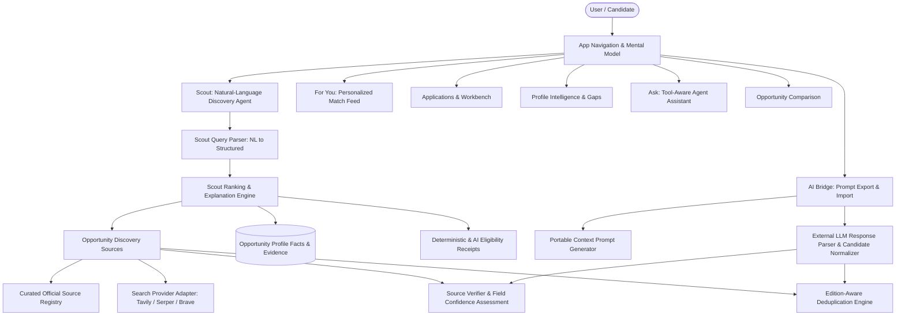

# AI Opportunity Agent Architecture

## Overview
OpportunityOS has been transformed from a static CRUD directory into an active, high-agency **Personal AI Opportunity Agent**.
Its mission is: **"Never miss an opportunity you could have won."**

The system actively learns who the user is, maintains a rich Opportunity Profile, discovers programs through multi-source aggregation, filters around real user constraints, ranks opportunities with transparent multi-dimensional explanations, strictly verifies requirement-level eligibility, flags actionable profile gaps, supports application drafting with real evidence, and bridges context seamlessly with external LLMs (ChatGPT, Claude, Gemini, Perplexity).

---

## 1. System Architecture & Layers

---

## 2. Core Subsystems

### A. Profile Intelligence (`src/lib/ai/profileAnalysis.ts`, `/profile`)
- **Rich Identity & Evidence**: Tracks nationalities/citizenship, residency, education stage, expected graduation, skills, target roles, location preferences, and paid-only requirements.
- **Evidence Linking**: Real projects, achievements, and experiences form the ground truth.
- **AI Gap Analysis**: Analyzes weak signals and calculates exact opportunity unlocks (e.g., "Adding graduation year unlocks eligibility verification for student programs").
- **Strict Grounding**: Never invents user accomplishments. Inferences must be explicitly approved by the user.

### B. Scout Engine (`src/lib/scout/`, `/scout`)
- **Natural Language Parsing**: Translates queries such as *"Find paid AI opportunities outside India for second-year Indian students"* into a typed `ScoutStructuredQuery`.
- **Automatic Context Merging**: Merges user's stored citizenship, graduation year, and skills without requiring repetitive prompting.
- **Explainable Ranking Dimensions**:
  - Profile Fit (0-100)
  - Requirement-level Eligibility verdict (`likely_eligible`, `possibly_eligible`, `likely_ineligible`, `unknown`)
  - Evidence Alignment (matching verified user projects and roles)
  - Upside Tags (Prestige, Stipend/Funding, Remote Accessible)
  - Estimated Effort (`quick`, `moderate`, `significant`)
  - Deadline Urgency & Freshness

### C. Discovery Sources & Deduplication (`src/opportunity-sources/`)
- **Source Registry (`registry.ts`)**: High-signal curated programs (GSoC, Mitacs, Thiel Fellowship, MLH, HackMIT, Y Combinator, etc.).
- **Provider-Independent Search Adapter (`adapter.ts`)**: Pluggable support for Tavily, Serper, and Brave Search, with guaranteed curated fallback when API keys are unconfigured.
- **Verifier (`verifier.ts`)**: Distinguishes official organizational domains from third-party aggregators and calculates per-field extraction confidence.
- **Edition-Aware Deduplication (`deduplicator.ts`)**: Protects against duplicate entries while respecting year editions (e.g. GSoC 2025 vs 2026).

### D. "For You" & Recommendation Feedback (`/for-you`, `/api/recommendations/feedback`)
- **Match Tiers**: Categorizes opportunities into *Exceptional match*, *Strong match*, *Possible*, and *Probably skip*.
- **Closed-Loop Feedback**: Users can mark *Interested*, *Not relevant*, or *Hide*. Hidden items can be reviewed and unhidden at any time.

### E. Decision View & Eligibility Receipts (`/opportunities/[id]`)
- **"Should I Apply?" Panel**: Quick decision summary displaying match tier, verified requirement count, effort, and deadline urgency.
- **Eligibility Receipt**: Requirement → Official Source Excerpt → User Fact → Verdict → Explanation & Uncertainty.
- **Strict Rule**: Unknown stays unknown. Missing citizenship or student status is never converted into an assumed pass.

### F. Workbench & Application Assistance (`/workspace/[id]`, `/api/applications/plan`)
- **Plan Generation**: Deconstructs requirements into verified profile alignments, required written responses, documents to upload, and timeline tasks.
- **Evidence Drawer & Answer Assistant**: Drafts authentic answers using ONLY selected user evidence and profile facts.

### G. AI Bridge (`src/lib/ai-bridge/`, `/ai-bridge`)
- **Copy for AI**: Generates concise, structured prompt templates containing verified user profile context for use in ChatGPT, Claude, Gemini, or Perplexity.
- **Import AI Response**: Accepts pasted LLM outputs, extracts candidate opportunities, performs deduplication, assesses verification, and presents an interactive review screen for selective database import.
- **Profile Learning**: Identifies skill or interest mentions in external text and surfaces them as optional, user-confirmed profile additions.

### H. Ask Agent (`/ask`, `/api/ask`)
- **Tool-Aware Assistant**: Server-side synthesized agent grounded in database opportunities, urgent deadlines, active applications, and profile gaps.

---

## 3. Database Persistence & Security
- Canonical `opportunities` table with edition years, source evidence, and verification timestamps.
- Row-Level Security (RLS) policies protecting user data (`profiles`, `applications`, `application_tasks`, `recommendation_feedback`, `scout_runs`, `saved_searches`).
- Safe `.maybeSingle()` queries across all detail handlers to prevent unhandled database exceptions.
